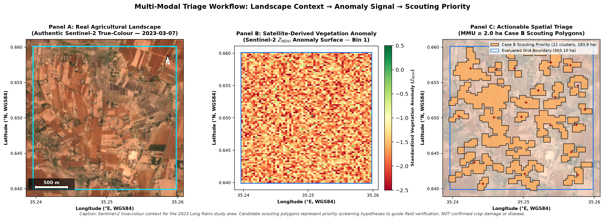

# Multi-Modal Agricultural Early Warning & Crop Health Intelligence Pipeline
[](https://www.python.org/downloads/release/python-3110/)
[]()
[]()

An end-to-end Earth Observation (EO) screening and spatial triage framework designed to identify anomalous co-occurrences of precipitation, root-zone soil moisture dynamics, and high-resolution optical canopy greenness across agricultural landscapes in Kenya.




---

## 1. Project Purpose & Problem Statement

Smallholder agricultural monitoring requires balancing spatial resolution and hydrological context. Optical satellite data (Sentinel-2 at 30 m) detects fine-scale canopy changes but cannot explain their underlying drivers, while macro-climatic datasets (CHIRPS at ~5.5 km, NASA SMAP at ~9.0 km) provide moisture context but lack field-scale granularity.

This system bridges that gap by establishing a **deterministic, multi-modal screening matrix** that enforces strict multi-sensor resolution integrity without artificial resampling. The pipeline identifies discrete, actionable candidate scouting polygons ($\ge 2.0\text{ ha}$ Minimum Mapping Unit) to guide ground extension officers on where to scout, rather than making unverified causal claims from space.

---

## 2. Study Area & Spatial Hierarchy

* **Regional Pilot AOI (`ug_pilot_moiben_01`)**: $0.20^\circ \times 0.20^\circ \approx 490.5\text{ km}^2$ ($49,050\text{ ha}$) in Uasin Gishu County, Kenya (`EPSG:4326`: $[35.15^\circ\text{ E}, 0.55^\circ\text{ N}, 35.35^\circ\text{ E}, 0.75^\circ\text{ N}]$).
* **Evaluated Focal Grid**: $86\text{ rows} \times 65\text{ columns}$ at $30.0\text{ m}$ in `EPSG:6933` ($503.10\text{ ha}$, $5,590\text{ cropland pixels}$).

---

## 3. Sensor Modalities & Core Workflow

```
[ CHIRPS Rainfall (5.5 km) ]   [ Sentinel-2 Reflectance (30 m) ]   [ NASA SMAP L4 SWI (9 km) ]
             │                                 │                                 │
             ▼                                 ▼                                 ▼
   Precipitation Z-Score             Vegetation Z-Score              Root-Zone SWI & ΔSWI_14d
      (Z_R vs 30-yr)                (Z_NDVI vs baseline)             (s1 level & 14-d trend)
             │                                 │                                 │
             └─────────────────────────┬───────┴─────────────────────────────────┘
                                       │
                                       ▼
                       [ DETERMINISTIC SCREENING MATRIX ]
                       • Case A (Drought Stress): Z_R ≤ -0.8 ∧ Z_NDVI ≤ -1.0
                       • Case B (Non-Dry Anomaly): Z_R ≥ 0.0 ∧ SWI ≥ 0.30 ∧ Z_NDVI ≤ -1.2
                       • Case C (Buffering): Z_R ≤ -1.0 ∧ SWI ≥ 0.30 ∧ Z_NDVI ≥ -0.5
                       • Case D (Rate Disconnect): Z_R ≥ 0.5 ∧ ΔSWI_14d ≤ 0.0
                       • MULTI_SIGNAL: Simultaneous Case B + Case D co-occurrence
                       • NORMAL (0): Climatologically expected range
                                       │
                                       ▼
                       [ SPATIAL TRIAGE & MMU FILTER ]
                       • 3×3 Opening + 8-Connectivity + ≥ 2.0 ha MMU Filter
                                       │
                                       ▼
                       [ PUBLIC DECISION DELIVERABLES ]
                       • Maps (300 DPI) + GeoJSON Scouting Polygons + Executive Reports
```

---

## 4. Key Results (2023 Long Rains Season)

* **15 Canonical 14-Day Bins**: Full contiguous coverage (`2023-03-01` to `2023-09-30`) with zero temporal gaps.
* **Drought Absence Confirmed**: $Z_R \ge +0.97$ across all bins; zero pixels triggered Case A or Case C drought rules.
* **28 Actionable Candidate Clusters**: $3,202.47\text{ ha}$ cumulative candidate scouting area extracted across 7 actionable bins.
* **Early-Season Fragmentation (Bin 1)**: 22 distinct Case B candidate clusters ($183.87\text{ ha}$) isolating intra-field establishment variability.
* **Late-Season Rate Disconnect (Bins 10–14)**: Case D screening triggered during grain filling as 14-day soil moisture declined ($\Delta\text{SWI}_{14d} < 0$) despite positive cumulative rainfall ($Z_R \ge +0.5$).
* **End-of-Season Maturation (Bin 15)**: MULTI_SIGNAL compound state ($503.10\text{ ha}$) coinciding with crop dry-down prior to harvest.

---

## 5. Core Scientific Limitations

1. **Spatial Scale Disparity**: CHIRPS ($5.5\text{ km}$) and SMAP ($9.0\text{ km}$) are spatially constant across the $503.10\text{ ha}$ focal block, causing Case D to evaluate uniformly across the sub-grid.
2. **Screening vs. Diagnosis**: Candidate zones represent spatial hypotheses for field inspection, NOT confirmed disease, pest damage, or yield loss.
3. **Operational Priors**: $\text{SWI} \ge 0.30$ is an operational screening threshold, not an in-situ calibrated permanent wilting point.

---

## 6. Major Outputs & Deliverables

All public stakeholder deliverables are located in [`export/`](export/):
* **01. System Architecture Diagram**: [`export/figures/project_overview_diagram.png`](export/figures/project_overview_diagram.png)
* **02. Regional Satellite Context**: [`export/figures/satellite_context_regional_2023.png`](export/figures/satellite_context_regional_2023.png)
* **03. Focal Landscape Context (Hero Image)**: [`export/figures/satellite_context_focal_2023.png`](export/figures/satellite_context_focal_2023.png)
* **04. Seasonal Diagnostic Profile**: [`export/figures/temporal_diagnostic_profile_2023.png`](export/figures/temporal_diagnostic_profile_2023.png)
* **05. Candidate Area Progression**: [`export/figures/diagnostic_area_timeline_2023.png`](export/figures/diagnostic_area_timeline_2023.png)
* **06. Flag-to-Triage Progression Visual**: [`export/figures/satellite_flag_to_triage_2023.png`](export/figures/satellite_flag_to_triage_2023.png)
* **07. Early-Season Anomaly Map (Bin 1)**: [`export/figures/spatial_diagnostic_bin_01.png`](export/figures/spatial_diagnostic_bin_01.png)
* **08. Spatial Persistence Heatmap**: [`export/figures/spatial_persistence_hotspots_2023.png`](export/figures/spatial_persistence_hotspots_2023.png)
* **09. End-of-Season Screening Map (Bin 15)**: [`export/figures/spatial_diagnostic_bin_15.png`](export/figures/spatial_diagnostic_bin_15.png)
* **10. Vector Scouting FeatureCollection**: [`export/geojson/seasonal_scouting_zones_2023.geojson`](export/geojson/seasonal_scouting_zones_2023.geojson)
* **Technical Portfolio Case Study**: [`export/reports/portfolio_case_study_2023.md`](export/reports/portfolio_case_study_2023.md)
* **Satellite Context Metadata Manifest**: [`export/reports/satellite_context_metadata.json`](export/reports/satellite_context_metadata.json)

---

## 7. Repository Structure

```
crop-stress-intelligence-kenya/
├── configs/                  # Project configuration & AOI geometries
├── docs/                     # Specifications, ADRs (ADR-001..029), & Data Dictionary
├── export/                   # Public stakeholder deliverables (figures, geojson, reports)
├── src/                      # Core analytical pipeline (ingestion, preprocessing, screening)
├── tests/                    # Comprehensive Pytest test suite (104 passing tests)
├── pyproject.toml            # Build metadata & dependency management
└── README.md                 # This overview guide
```

---


### Run Full Production Pipeline
```bash
python scratch/generate_m6_production_artifacts.py
```
