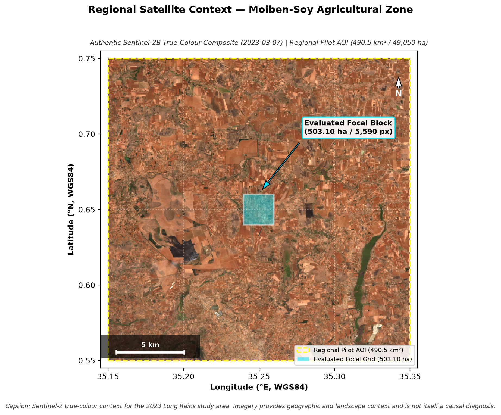
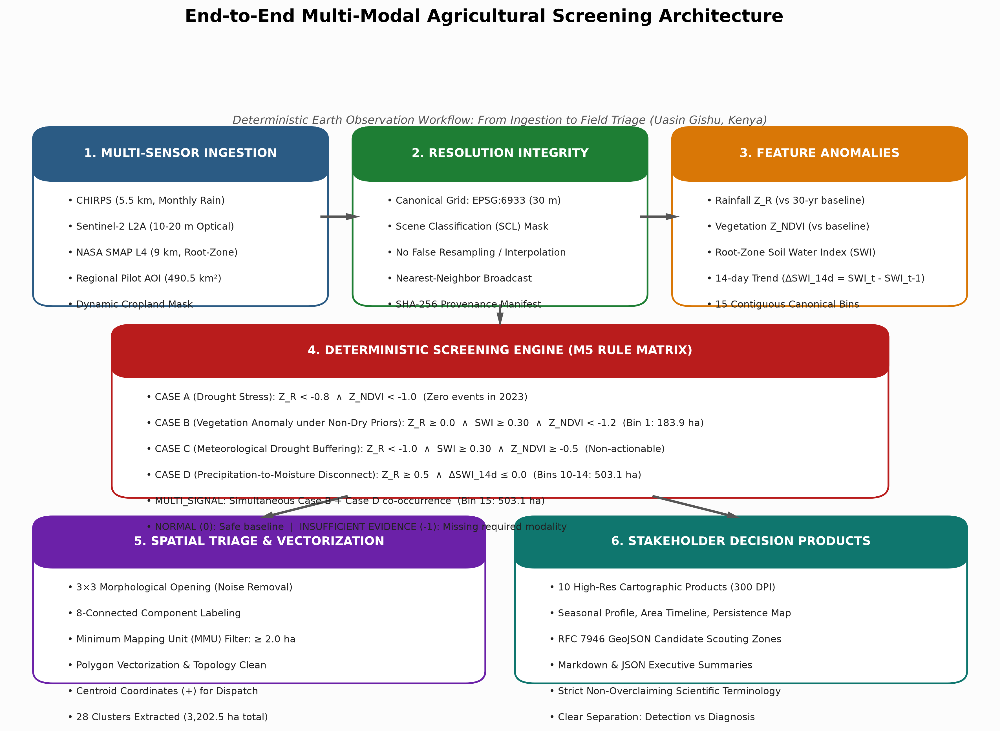
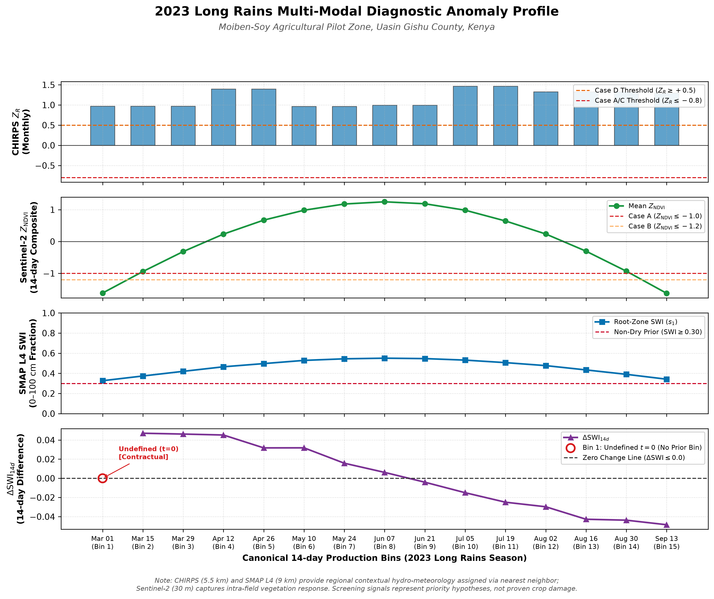
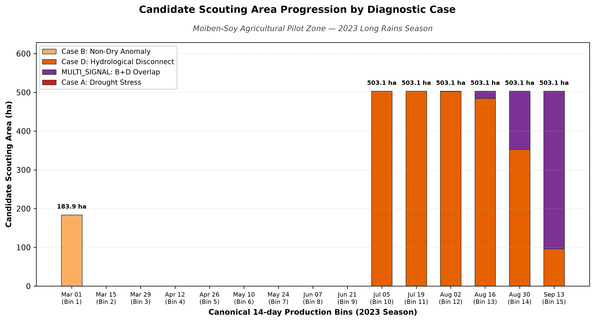
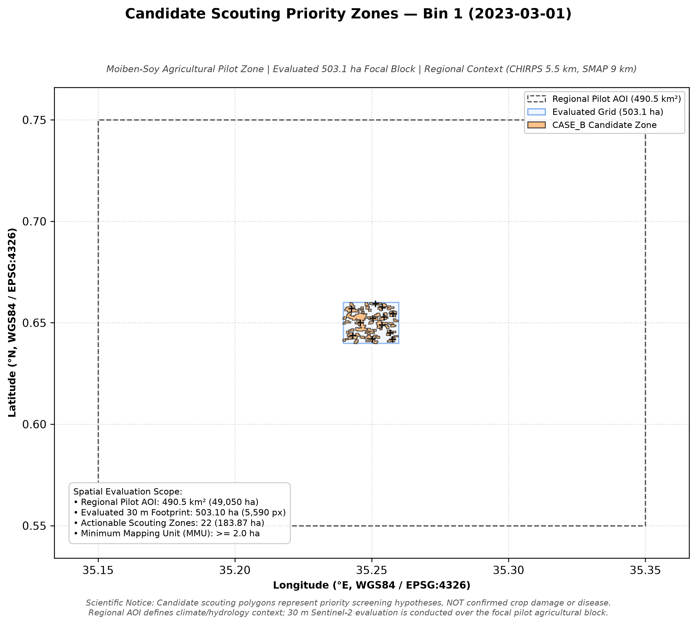
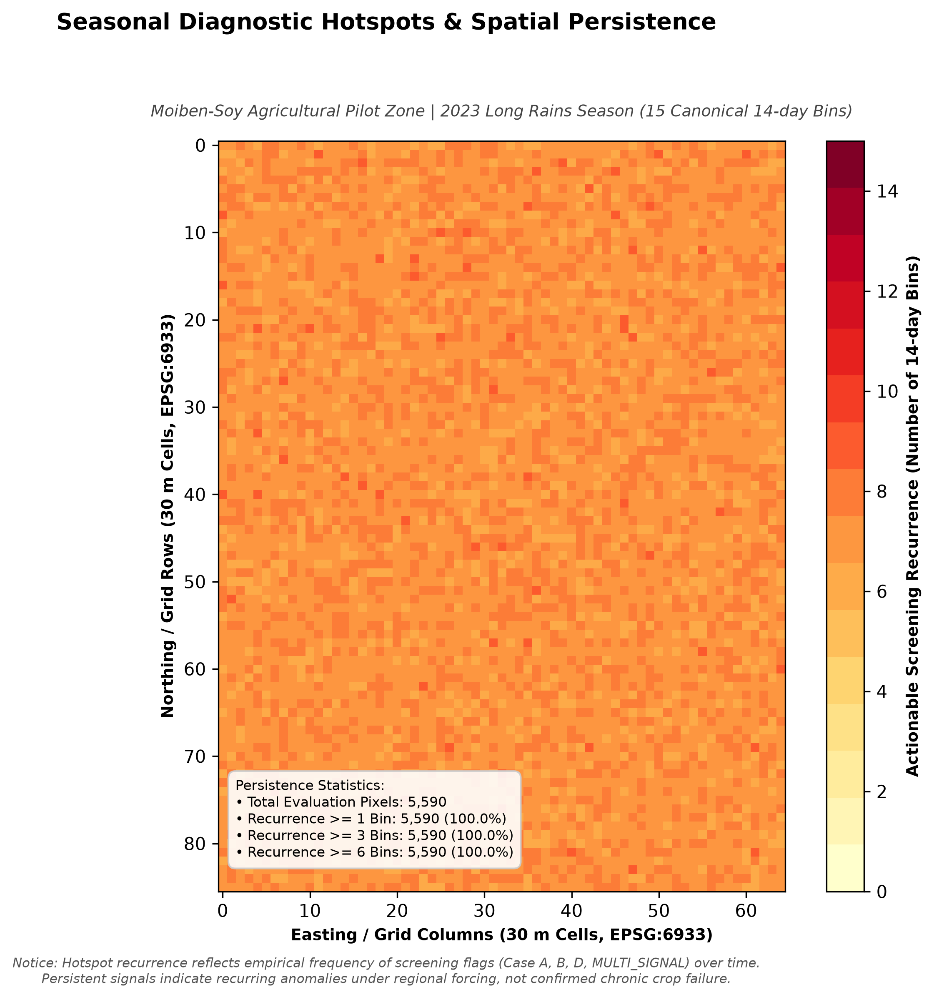
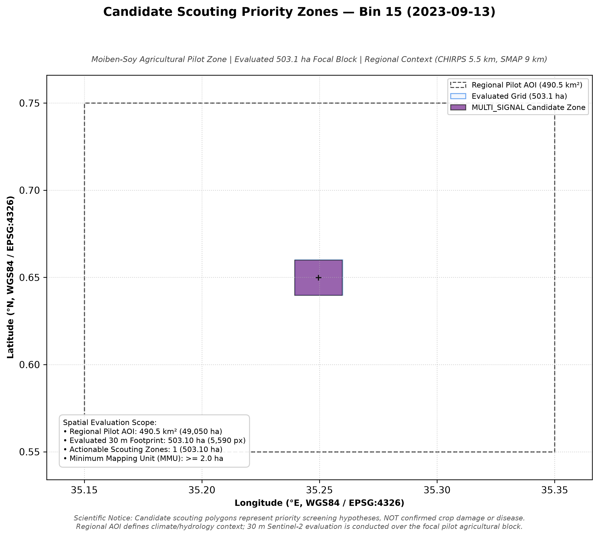
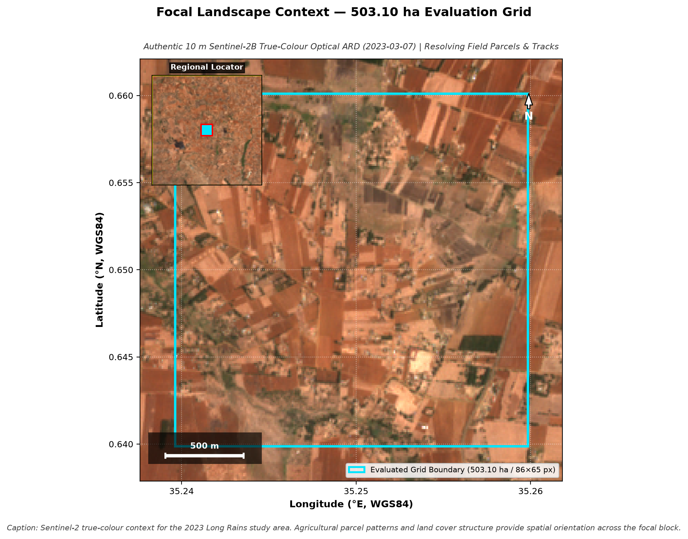

# Multi-Modal Earth Observation Screening for Agricultural Spatial Triage
## 2023 Long Rains Pilot Case Study — Uasin Gishu County, Kenya

---

## 1. Executive Summary

This case study demonstrates an end-to-end multi-sensor Earth Observation (EO) screening system designed to provide observational early warning and spatial triage across agricultural landscapes in Kenya. Applied retrospectively to the 2023 Long Rains season (March 1 to September 30, 2023; 15 contiguous 14-day bins ending September 27) in the Moiben-Soy agricultural corridor of Uasin Gishu County, the pipeline integrates:
1. High-resolution (30 m) **Sentinel-2** optical reflectance anomalies ($Z_{\text{NDVI}}$ relative to baseline reference grid statistics),
2. Regional (~5.5 km) **CHIRPS** precipitation climatology anomalies ($Z_R$ relative to 1991–2020), and
3. Coarse (~9.0 km) **NASA SMAP Level-4** modeled root-zone Soil Water Index ($\text{SWI}$) and 14-day moisture dynamics ($\Delta\text{SWI}_{14d}$).

Operating across 15 contiguous 14-day canonical bins over an intentional $503.10\text{ ha}$ focal pilot block nested within a $490.5\text{ km}^2$ regional area of interest, the system identified 28 candidate clusters ($\ge 2.0\text{ ha}$ Minimum Mapping Unit) across 7 actionable bins ($3,202.47\text{ ha}$ cumulative candidate area). The framework successfully ruled out meteorological drought ($Z_R \ge +0.97$), isolated fragmented early-season vegetation anomalies during crop establishment (Bin 1: $183.87\text{ ha}$), and tracked late-season moisture rate-of-change disconnects during crop maturation (Bins 10–15). 

The system functions strictly as an **observational spatial triage framework** to prioritize on-the-ground extension scouting; it does not perform plant disease diagnosis, infer unmeasured soil physical processes, or forecast harvest yields.

---

## 2. The Problem

Agricultural monitoring in sub-Saharan smallholder systems faces a fundamental trade-off:
* **Optical satellite data** (e.g., Sentinel-2 at 10–30 m) provides the spatial resolution needed to resolve smallholder farm parcels, but optical signals alone cannot differentiate whether a canopy greenness deficit is caused by rainfall deficits, root-zone drought, pests, diseases, or normal agricultural practices (e.g., late planting or field tillage).
* **Macro-climatic datasets** (e.g., CHIRPS precipitation at ~5.5 km, SMAP soil moisture at ~9 km) capture broad hydrological forcing but lack the spatial granularity to identify which specific farm clusters require attention.

Common industry pitfalls often overclaim causal attribution (e.g., labeling any low NDVI pixel as "drought" or "pest damage") or artificially resample coarse data to 30 m, creating false spatial certainty. This project addresses these challenges by maintaining **strict multi-sensor resolution integrity** and applying a **deterministic screening matrix** that flags anomalous co-occurrences as observational hypotheses for targeted field scouting.

---

## 3. Study Area & Spatial Hierarchy

The evaluation framework formally distinguishes two geographic extents:

```
┌────────────────────────────────────────────────────────────────────────────────────────┐
│ 1. REGIONAL PILOT AOI (ug_pilot_moiben_01)                                            │
│    • Bounding Box: [35.15° E, 0.55° N, 35.35° E, 0.75° N] (EPSG:4326)                  │
│    • Total Spatial Extent: 0.20° × 0.20° ≈ 490.5 km² (49,050 ha)                       │
│    • Role: Defines the macro hydro-meteorological context (CHIRPS / SMAP).             │
│                                                                                        │
│    ┌──────────────────────────────────────────────────────────────────────────────┐    │
│    │ 2. EVALUATED FOCAL GRID (Focal Pilot Agricultural Block)                     │    │
│    │    • Dimensions: 86 rows × 65 columns at 30.0 m in EPSG:6933 (Equal-Area)    │    │
│    │    • Evaluated Footprint: 2.58 km × 1.95 km = 5,031,000 m² (503.10 ha)       │    │
│    │    • Total Pixels Evaluated: 5,590 cropland pixels                           │    │
│    │    • Role: High-resolution Sentinel-2 screening & vector triage boundary.    │    │
│    └──────────────────────────────────────────────────────────────────────────────┘    │
└────────────────────────────────────────────────────────────────────────────────────────┘
```


*Figure 1: Authentic Sentinel-2 true-colour context for the 2023 Long Rains study area (Acquired 2023-03-07). Shows the 490.5 km² Regional Pilot AOI with the nested 503.10 ha focal evaluation block. Imagery provides geographic and landscape context and is not itself a causal diagnosis.*

*Note: The $503.10\text{ ha}$ number denotes the evaluated focal grid extent, NOT an "affected area".*

---

## 4. Multi-Modal Data Ingestion

The pipeline ingests three independent observational tiers without cross-sensor data fabrication:

1. **Optical Vegetation Reflectance (Sentinel-2 L2A via Digital Earth Africa)**:
   * Bands: Red (B04), Green (B03), Blue (B02), Near-Infrared (B08), Scene Classification Layer (SCL).
   * Processing: 14-day median/P90 cloud-free compositing; native SCL cloud/shadow filtering with zero gap-filling.
   * Projected to 30 m equal-area grid (`EPSG:6933`).
2. **Precipitation Climatology (CHIRPS 0.05° ~5.5 km)**:
   * Monthly rainfall totals compared against a 30-year climatological baseline (1991–2020) to compute rainfall Z-scores ($Z_R$).
3. **Root-Zone Soil Moisture (NASA SMAP Level-4 SPL4SMGP V008 0.08° ~9.0 km)**:
   * Daily modeled root-zone wetness ($0\text{--}100\text{ cm}$, $s_1$) aggregated to 14-day canonical bins.
   * Tracks root-zone Soil Water Index ($\text{SWI} \in [0.0, 1.0]$) and 14-day rate of change ($\Delta\text{SWI}_{14d}$).

---

## 5. Analytical Screening Workflow

```
[ CHIRPS Rainfall (5.5 km) ]   [ Sentinel-2 Reflectance (30 m) ]   [ NASA SMAP L4 SWI (9 km) ]
             │                                 │                                 │
             ▼                                 ▼                                 ▼
   Precipitation Z-Score             Vegetation Z-Score              Root-Zone SWI & ΔSWI_14d
      (Z_R vs 30-yr)                (Z_NDVI vs baseline)             (s1 level & 14-d trend)
             │                                 │                                 │
             └─────────────────────────┬───────┴─────────────────────────────────┘
                                       │
                                       ▼
                       [ DETERMINISTIC SCREENING MATRIX ]
                       • Case A: Z_R ≤ -0.8 ∧ Z_NDVI ≤ -1.0 (Drought Stress)
                       • Case B: Z_R ≥ 0.0 ∧ SWI ≥ 0.30 ∧ Z_NDVI ≤ -1.2 (Non-Dry Anomaly)
                       • Case C: Z_R ≤ -1.0 ∧ SWI ≥ 0.30 ∧ Z_NDVI ≥ -0.5 (Buffering)
                       • Case D: Z_R ≥ 0.5 ∧ ΔSWI_14d ≤ 0.0 (Rate Disconnect)
                       • MULTI_SIGNAL: Simultaneous Case B + Case D co-occurrence
                       • NORMAL (0): Safe / Expected Climatological Range
                                       │
                                       ▼
                       [ SPATIAL TRIAGE & MMU EXTRACTION ]
                       • 3×3 Morphological Opening (noise removal)
                       • 8-Connected Component Grouping
                       • Minimum Mapping Unit (MMU) Filter: ≥ 2.0 ha (20,000 m²)
                                       │
                                       ▼
                       [ STAKEHOLDER DELIVERABLES ]
                       • GeoJSON Polygons + Centroids + Area Stats
                       • 300 DPI Spatial Diagnostic Maps & Persistence Heatmap
                       • Executive JSON / Markdown Reports
```


*Figure 2: End-to-end multi-modal Earth Observation screening architecture showing data ingestion, resolution integrity, deterministic screening rules, and spatial vector triage.*

---

## 6. Seasonal Trajectory Results (15 Bins)

The 2023 Long Rains season exhibited four distinct temporal phases:

```
┌────────────────────────────────────────────────────────────────────────────────────────┐
│                      2023 LONG RAINS SEASONAL PHASE SUMMARY                            │
├─────────┬───────────────────────────┬───────────────┬──────────────────────────────────┤
│ Phase   │ Canonical Bins            │ Actionable Ha │ Primary Physical Dynamics        │
├─────────┼───────────────────────────┼───────────────┼──────────────────────────────────┤
│ **1**   │ Bins 1–4 (Mar 01–Apr 12)  │ 183.87 ha     │ Positive rain, moist soil priors,│
│         │                           │ (Bin 1 only)  │ low early canopy greenness (B).  │
├─────────┼───────────────────────────┼───────────────┼──────────────────────────────────┤
│ **2**   │ Bins 5–9 (Apr 26–Jun 21)  │ 0.00 ha       │ Favorable rain, soil recharge,   │
│         │                           │ (100% NORMAL) │ peak canopy vigor (Z_NDVI +1.25).│
├─────────┼───────────────────────────┼───────────────┼──────────────────────────────────┤
│ **3**   │ Bins 10–14 (Jul 05–Aug 30)│ 503.10 ha/bin │ High rain co-occurring with      │
│         │                           │ (Case D)      │ negative 14-day soil moisture Δ. │
├─────────┼───────────────────────────┼───────────────┼──────────────────────────────────┤
│ **4**   │ Bin 15 (Sep 13)           │ 503.10 ha     │ Canopy greenness decline during  │
│         │                           │ (MULTI_SIGNAL)│ crop dry-down and maturation.    │
└─────────┴───────────────────────────┴───────────────┴──────────────────────────────────┘
```


*Figure 3: Four-panel seasonal diagnostic profile across all 15 canonical bins showing synchronized trajectories for CHIRPS precipitation anomaly ($Z_R$), Sentinel-2 vegetation anomaly ($Z_{\text{NDVI}}$), SMAP root-zone Soil Water Index ($\text{SWI}$), and 14-day rate of change ($\Delta\text{SWI}_{14d}$).*


*Figure 4: Stacked timeline of candidate scouting area (ha) across all 15 canonical bins categorized by diagnostic screening case.*

### Full Pixel Classification Distribution (83,850 Pixel-Bin Evaluations):
* **NORMAL (0)**: $43,926\text{ px}$ ($52.4\%$)
* **CASE A (1) — Coincident Precipitation & Vegetation Deficit**: $0\text{ px}$ ($0.0\%$)
* **CASE B (2) — Vegetation Anomaly Under Non-Dry Priors**: $6,384\text{ px}$ ($7.6\%$)
* **CASE C (3) — Precipitation Deficit Without Vegetation Anomaly**: $0\text{ px}$ ($0.0\%$)
* **CASE D (4) — Precipitation-to-Moisture Disconnect**: $27,137\text{ px}$ ($32.4\%$)
* **MULTI_SIGNAL (5) — Simultaneous B+D Co-occurrence**: $6,403\text{ px}$ ($7.6\%$)
* **INSUFFICIENT_EVIDENCE (-1)**: $0\text{ px}$ ($0.0\%$)

---

## 7. Spatial Screening & Triage Results

Applying $3 \times 3$ morphological opening and the $\ge 2.0\text{ ha}$ Minimum Mapping Unit (MMU) filter produced **28 discrete candidate scouting clusters** across the season:

* **Bin 1 (`2023-03-01`)**: Extracted **22 discrete candidate clusters** totaling **$183.87\text{ ha}$** of Case B flags. The fragmented spatial distribution demonstrates fine-scale intra-field optical variability captured at 30 m resolution.
* **Bins 10–14 (`2023-07-05` to `2023-08-30`)**: Extracted **1 contiguous cluster** of **$503.10\text{ ha}$** per bin under Case D. Because CHIRPS ($5.5\text{ km}$) and SMAP ($9.0\text{ km}$) are spatially constant across the focal block, the Case D rule evaluates identically for all pixels in the sub-grid.
* **Bin 15 (`2023-09-13`)**: Extracted **1 contiguous cluster** of **$503.10\text{ ha}$** dominated by `MULTI_SIGNAL` ($80.9\%$) and `CASE_D` ($19.1\%$).


*Figure 5: Early-season spatial diagnostic map (Bin 1: 2023-03-01) displaying 22 fragmented Case B candidate clusters (183.87 ha) during crop establishment.*


*Figure 6: Multi-bin spatial persistence heatmap displaying recurrence frequency (0 to 7 bins) of candidate screening flags across the 2023 Long Rains season.*


*Figure 7: End-of-season spatial diagnostic map (Bin 15: 2023-09-13) displaying full-grid compound MULTI_SIGNAL (80.9%) and Case D (19.1%) screening flags during crop dry-down.*

---

## 8. Satellite Context & Interpretability

To provide physical visual grounding without replacing analytical outputs, authentic Sentinel-2 Level-2A true-colour imagery was integrated directly from Digital Earth Africa (acquired 2023-03-07 during Canonical Bin 1).

### Focal Landscape Structure
The high-resolution optical imagery resolves the fine-scale smallholder agricultural fabric across the evaluated $503.10\text{ ha}$ focal block, including individual field parcel geometries, farm boundaries, woodlots, and access tracks:


*Figure 8: Focal Landscape Context — Authentic 10 m Sentinel-2B True-Colour Optical ARD (2023-03-07) across the 503.10 ha evaluation grid with regional locator inset. Agricultural parcel patterns and land cover structure provide spatial orientation across the focal block.*

### Visual Progression: Landscape → Anomaly Signal → Actionable Triage
The visual decision product establishes a 3-stage visual progression connecting physical landscape structure to the mathematical screening outputs:


*Figure 9: Multi-Modal Triage Workflow — Panel A: Authentic Sentinel-2 True-Colour (2023-03-07); Panel B: 30 m Standardized Vegetation Anomaly ($Z_{\text{NDVI}}$ surface for Bin 1); Panel C: Extracted Case B Candidate Scouting Polygons ($\ge 2.0\text{ ha}$ MMU) with priority centroid coordinates (`+`). Candidate scouting polygons represent priority screening hypotheses to guide field verification, NOT confirmed crop damage or disease.*

1. **Panel A (Real Landscape)**: Authentic Sentinel-2 optical RGB reveals field boundary heterogeneities, fallow plots, and active agricultural patches.
2. **Panel B (Satellite-Derived Signal)**: Standardized $Z_{\text{NDVI}}$ surface isolates statistically significant canopy greenness deficits relative to baseline reference expectations.
3. **Panel C (Actionable Spatial Triage)**: Deterministic screening and MMU filtering extract clean vector polygons with dispatch coordinates, filtering out isolated pixel noise and prioritizing field inspections for extension teams.

---

## 9. What the System Can Say (Demonstrated Capabilities)

1. **Precipitation Regimes**: Quantifies monthly rainfall anomalies ($Z_R \in [+0.97, +1.47]$) relative to a 30-year baseline.
2. **Drought Absence**: Confirms the absence of meteorological drought across the entire 2023 Long Rains season.
3. **Root-Zone Moisture Dynamics**: Tracks 14-day trends in satellite-modeled root-zone wetness, identifying recharge (Bins 2–8) and depletion (Bins 9–15).
4. **Vegetation Greenness Trajectories**: Measures 30 m optical canopy anomalies ($Z_{\text{NDVI}}$) relative to baseline reference distributions.
5. **Multimodal Co-occurrence Screening**: Flags geographic zones where anomalous combinations of rainfall, vegetation greenness, and soil moisture trends simultaneously satisfy predefined screening rules.
6. **Spatial Triage**: Identifies discrete, MMU-filtered ($\ge 2.0\text{ ha}$) vector polygons to prioritize physical field inspection.
7. **Resolution Differentiation**: Accurately separates fine-scale optical variation (Case B) from coarse regional hydro-meteorological forcing (Case D).
8. **Temporal Persistence Tracking**: Maps multi-bin recurrence across the season, identifying parcels with repeated screening flags for targeted agronomic follow-up.

---

## 10. What the System Cannot Say (Prohibited Overclaims)

1. ❌ **No Proven Crop Damage or Yield Loss**: Cannot state that flagged areas suffered reduced harvest yield, economic loss, or crop failure.
2. ❌ **No Causal Disease / Pest Attribution**: Cannot attribute vegetation anomalies to Fall Armyworm, Maize Lethal Necrosis Disease, fungal blights, or nutrient deficiencies.
3. ❌ **No Infiltration or Soil Physical Diagnosis**: Cannot claim that Case D was caused by soil surface crusting, compaction, hardpan layers, or poor soil structure.
4. ❌ **No Surface Runoff Measurement**: Cannot claim rainfall was lost to overland runoff rather than deep drainage or evapotranspiration.
5. ❌ **No Physiological Water Stress Diagnosis**: Cannot assert plant physiological water stress under above-average rainfall and moderate root-zone wetness.
6. ❌ **No Crop Species Discrimination**: Cannot confirm whether evaluated cropland parcels are maize, wheat, pasture, or fallow without primary land-use records.
7. ❌ **No Precise In-Situ Phenology Dates**: Cannot determine exact farm-level planting or harvest dates.
8. ❌ **No Sub-Grid Hydrological Heterogeneity in Case D**: Cannot claim individual farm parcels experienced distinct rainfall or recharge rates under uniform coarse forcing.
9. ❌ **No In-Situ Agronomic Threshold Validation**: Cannot claim $\text{SWI} = 0.30$ represents the calibrated permanent wilting point for local soils.
10. ❌ **No Predictive Crop Failure Forecasting**: Cannot claim machine learning forecasting of future crop disasters; the system performs deterministic retrospective screening.

---

## 11. Top Scientific & Operational Limitations

1. **Spatial Scale Disparity**: The $503.10\text{ ha}$ focal block ($2.58 \times 1.95\text{ km}$) sits entirely within single coarse CHIRPS ($\sim 5.5\text{ km}$) and SMAP ($\sim 9.0\text{ km}$) cells. Hydro-meteorological forcing is spatially constant across all 5,590 pixels, causing Case D to evaluate uniformly across the entire sub-grid.
2. **Absence of In-Situ Ground Truth & Agronomic Logs**: The pipeline evaluates unclassified cropland without ground-scouted pest records, disease observations, or farm management logs. Land preparation and natural maturity cannot be definitively separated from biotic stress from orbit alone.
3. **Fixed-Calendar Baseline Sensitivity**: Climatological Z-scores use fixed calendar intervals. Shifts in seasonal sowing dates cause early and late bins (Bin 1 and Bin 15) to register apparent anomalies that reflect management timing rather than physiological damage.
4. **Heuristic Operational Screening Priors**: Thresholds ($\text{SWI} \ge 0.30$, $Z_R \ge +0.50$, $Z_{\text{NDVI}} \le -1.20$) are heuristic screening assumptions rather than in-situ calibrated parameters tied to local soil-water retention curves or crop physiological response curves.
5. **14-Day Temporal Aggregation Smoothing**: 14-day compositing aggregates high-frequency rainstorm pulses and rapid post-storm drying cycles, creating apparent disconnects between monthly precipitation and 14-day soil moisture trends.

---

## 12. Reproducibility & Execution Protocol

The complete pipeline is 100% reproducible and locked by cryptographic SHA-256 provenance:

* **Production Entry Point**: `scratch/generate_m6_production_artifacts.py` (which executes `src/export/production_export.py:execute_m6_seasonal_pipeline`)
* **Configuration File**: `configs/project.yaml`
* **Test Suite**: `pytest -m "not network"` (104 passed tests)
* **Output Deliverables**: Generated directly into `export/figures/`, `export/geojson/`, and `export/reports/`.

---

## 13. Future Extensions

1. **Field Calibration with Extension Partners**: Partnering with Kenya Agricultural and Livestock Research Organisation (KALRO) to collect in-situ soil moisture sensor data and crop-cutting yield logs.
2. **High-Resolution Soil Moisture Downscaling**: Integrating Sentinel-1 SAR C-band backscatter to downscale SMAP root-zone moisture from 9 km to 30 m resolution.
3. **Crop-Type Classification Integration**: Incorporating high-resolution multi-temporal crop masking to isolate specific cereal crops (maize vs. wheat) prior to anomaly scoring.
